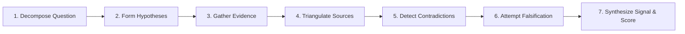

<div align="center">

# ⚡ SignalForge

**Find the signal. Challenge the signal.**

*An AI-powered financial research intelligence system that connects fragmented evidence, detects contradictions, and subjects emerging theses to rigorous self-falsification.*

---

[](https://reactjs.org/)
[](https://www.typescriptlang.org/)
[](https://vitejs.dev/)
[](https://tailwindcss.com/)
[](https://fastapi.tiangolo.com/)
[](https://www.python.org/)

</div>

---

## 📖 Overview

In modern financial and equity research, **information is abundant, but clarity is scarce**. Analysts drown in hundreds of pages of 10-K filings, earnings call transcripts, industry trackers, customer panel data, and peer reports. Most AI tools summarize individual documents in isolation, amplifying confirmation bias without challenging company claims.

**SignalForge** reimagines equity research as an adversarial, hypothesis-driven intelligence pipeline. Rather than simply summarizing text, SignalForge actively searches for discrepancies between management commentary and empirical external data, attempts to falsify its own leading theses, and computes a transparent, weighted signal score.

---

## 🏛️ The 7-Step Methodology

SignalForge structures institutional investigations through an epistemic framework:



1. **Decompose the Question**: Dissects broad inquiries into focused vectors across growth, margins, competitive dynamics, and structural risk.
2. **Form Hypotheses**: Drafts competing explanatory theses *before* digesting evidence to mitigate confirmation bias.
3. **Gather Evidence**: Extracts atomic claims across company filings, third-party benchmarks, peer disclosures, and alternative data.
4. **Triangulate Sources**: Measures convergence and divergence across independent sources evaluating the same claim.
5. **Detect Contradictions**: Surfaces discrepancies where management claims directly clash with empirical market data.
6. **Attempt to Falsify**: Stress-tests the leading thesis by actively querying for falsifiers and disconfirming evidence.
7. **Evaluate the Signal**: Computes a multi-dimensional weighted score across strength, source quality, consensus, novelty, and contradiction risk.

---

## 🧮 Signal Scoring Engine

The SignalForge score ($S \in [0, 10]$) provides an interpretable quantitative evaluation of thesis credibility:

$$\text{Signal Score} = 0.30 \cdot E + 0.20 \cdot Q + 0.15 \cdot A + 0.25 \cdot N + 0.10 \cdot (10 - C)$$

| Dimension | Weight | Description |
| :--- | :---: | :--- |
| **Evidence Strength ($E$)** | `30%` | Depth, granularity, and statistical backing of collected observations. |
| **Source Quality ($Q$)** | `20%` | Reliability hierarchy (Audited Filings > Regulatory Data > Industry Reports > Sell-Side). |
| **Cross-Source Agreement ($A$)** | `15%` | Degree of corroboration between independent third-party sources. |
| **Novelty ($N$)** | `25%` | Information edge not yet broadly priced into sell-side consensus. |
| **Contradiction Inversion ($10 - C$)** | `10%` | Resilience against unresolved contradictory empirical data points. |

---

## ✨ Features & Interface Modules

- 🌌 **Cinematic 3D Interactive Hero**: Interactive isometric document stack reacting dynamically to cursor perspective.
- 🔬 **Research Query Studio**: Configure targeted investigations with company parameters, hypotheses, and focus areas.
- 📡 **Live Run Pipeline**: Progress tracking that transitions seamlessly between live API telemetry and bundled offline datasets.
- 📊 **Signal Radar & KPI Center**: High-density interactive Recharts radar chart mapping all 5 scoring dimensions alongside active hypothesis confidence gauges.
- 📑 **Evidence Matrix**: Filterable claim feed (`SUPPORTS`, `CONTRADICTS`, `NEUTRAL`) with confidence metrics and origin attribution.
- ⚡ **Contradiction Explorer**: Accordion analysis comparing company statements directly with external market signals and plausible hypotheses.
- 🛡️ **Self-Falsification Suite**: Direct stress-testing of the core investment thesis with potential falsifiers, evidence found, and risk ratings.
- 🕸️ **Topological Research Graph**: Custom interactive SVG bezier node-link visualization connecting research questions, hypotheses, contradictions, evidence nodes, and final signals.
- 📑 **Dossier & Markdown Report Export**: One-click generation and download of formatted, auditable research memos.

---

## 🗂️ Repository Architecture

```
SignalForge/
├── backend/
│   ├── main.py              # FastAPI server & DemoAgent research pipeline
│   ├── requirements.txt     # Python backend dependencies (FastAPI, Uvicorn, Pydantic)
│   └── .venv/               # Python virtual environment
├── frontend/
│   ├── index.html           # HTML entry point with typography imports
│   ├── package.json         # React 18, Vite 5, Tailwind v4, Motion, Lucide, Recharts
│   ├── tsconfig.json        # TypeScript configuration
│   ├── vite.config.ts       # Vite configuration with backend /api proxy
│   └── src/
│       ├── main.tsx         # Application entry point & router setup
│       ├── App.tsx          # Main shell, navigation tabs, Overview, Evidence, Reports
│       ├── Landing.tsx      # Interactive landing page & 3D methodology stack
│       ├── Run.tsx          # Research execution & live pipeline tracker
│       ├── Graph.tsx        # Topological SVG node-link research graph
│       ├── ctx.ts           # Global application state & context
│       ├── ui.tsx           # Shared design tokens, badges, cards, and buttons
│       ├── index.css        # Tailwind v4 theme tokens & luxury dark aesthetics
│       └── demo.json        # Structured research dataset & single source of truth
└── README.md
```

---

## 🚀 Quick Start Guide

### Prerequisites
- **Node.js**: v18.0.0 or later
- **npm**: v9.0.0 or later
- **Python**: v3.10 or later

---

### 1. Backend Setup (FastAPI)

```bash
cd backend
python -m venv .venv

# Activate virtual environment
# Windows (PowerShell):
.venv\Scripts\Activate.ps1
# macOS / Linux:
source .venv/bin/activate

pip install -r requirements.txt
uvicorn main:app --reload --port 8000
```
*The FastAPI backend will be available at [http://localhost:8000](http://localhost:8000) (Health check: [http://localhost:8000/api/health](http://localhost:8000/api/health)).*

---

### 2. Frontend Setup (React + Vite)

In a new terminal window:

```bash
cd frontend
npm install
npm run dev
```
*The Vite frontend will launch at [http://localhost:5173](http://localhost:5173).*

> [!NOTE]
> Vite is pre-configured to reverse-proxy `/api/*` requests directly to `http://localhost:8000`. If the backend is not running, the frontend gracefully falls back to bundled illustrative research datasets.

---

### 3. Production Build

To test or generate the production bundle:

```bash
cd frontend
npm run build
npm run preview
```

---

## 🔌 Extending to Live AI / Web Search

`backend/main.py` provides a modular `DemoAgent` interface designed to be swapped with live multi-agent LLM orchestrators (e.g., LangGraph, AutoGen, Google Gemini, OpenAI, or Claude):

```python
class ResearchAgent:
    async def plan(self, q: Query):
        """Decompose query into sub-questions using an LLM."""
        ...

    async def collect(self, subquestions):
        """Query SEC EDGAR, Google Search API, Bloomberg/FactSet, or Tavily."""
        ...

    async def triangulate_and_falsify(self, evidence):
        """Run contradiction detection & adversary falsification passes."""
        ...

    async def score(self, findings) -> dict:
        """Compute final 5-axis signal scores and return structured JSON."""
        ...
```

---

## ⚖️ Disclaimer

*SignalForge is an illustrative research demonstration. All figures, quotes, company names, and data points included in the demo datasets are synthetic and for demonstration purposes only. They do not constitute financial advice or investment recommendations.*

---

<div align="center">
Made with precision for deep research clarity.
</div>
